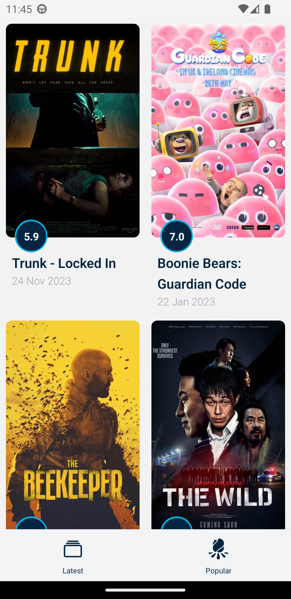
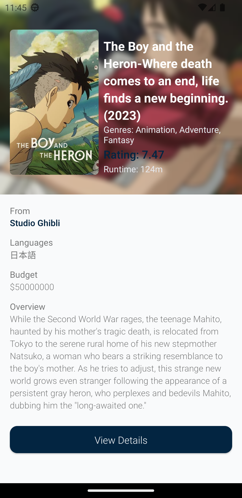
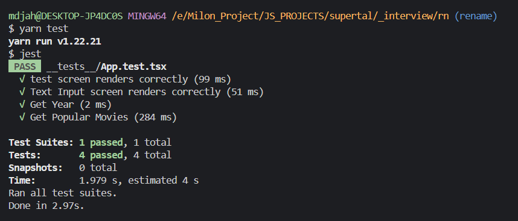

# TMDB Movie List App with React Native

> Developer Guide

## How to run

    ```bash
    git clone https://github.com/milon27/supertal-rn-interview-task.git
    yarn
    yarn start
    ```

> APK FILE

## [You can download the APK here](https://github.com/milon27/supertal-rn-interview-task/raw/master/tmdb.apk)

> features with screenshot

-   # Latest Movie List

    

-   # Popular Movie List

    

-   # Movie Detail Page

    

-   # Unite Test

    
