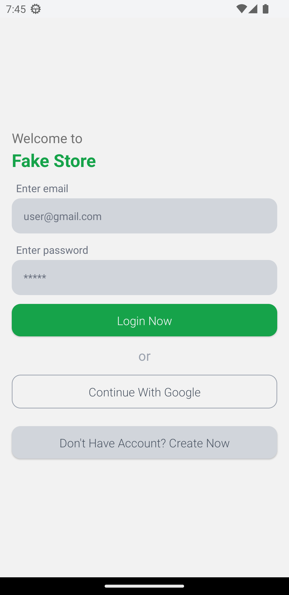
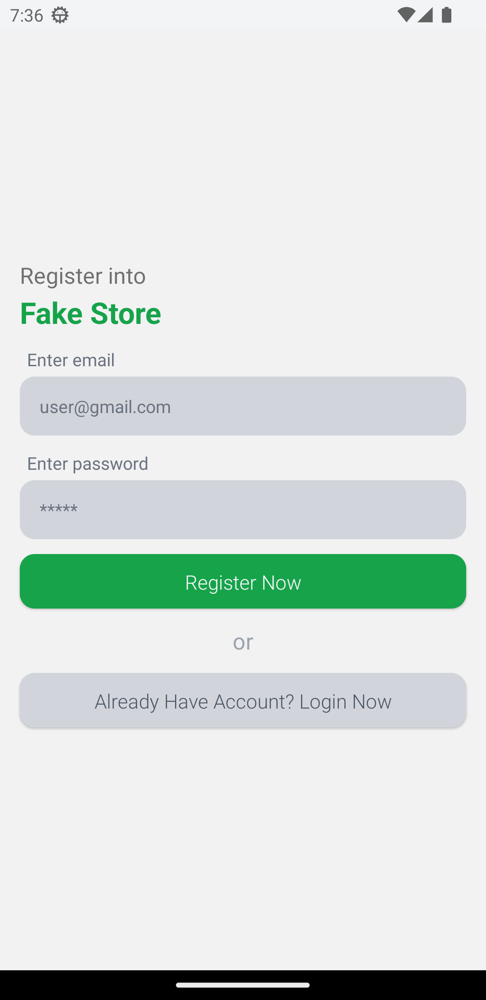
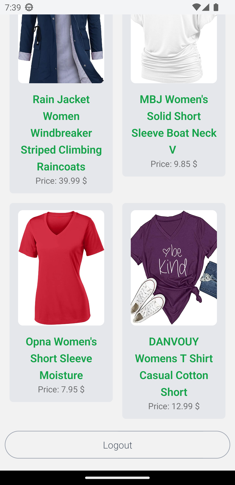
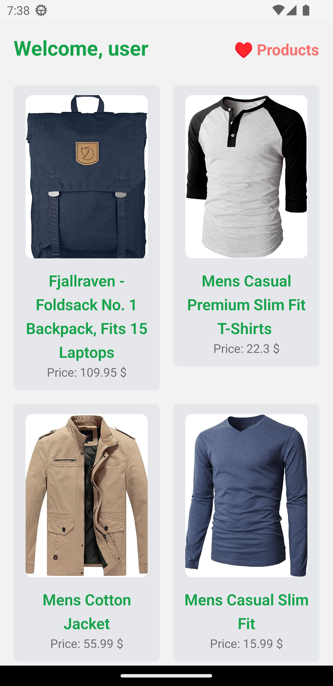
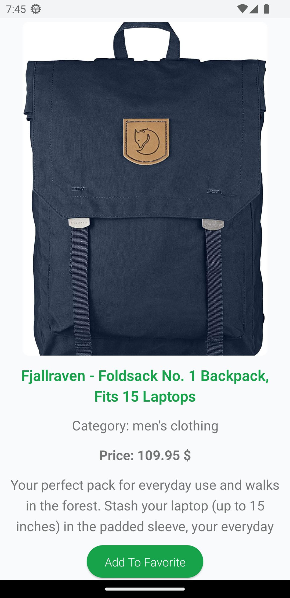
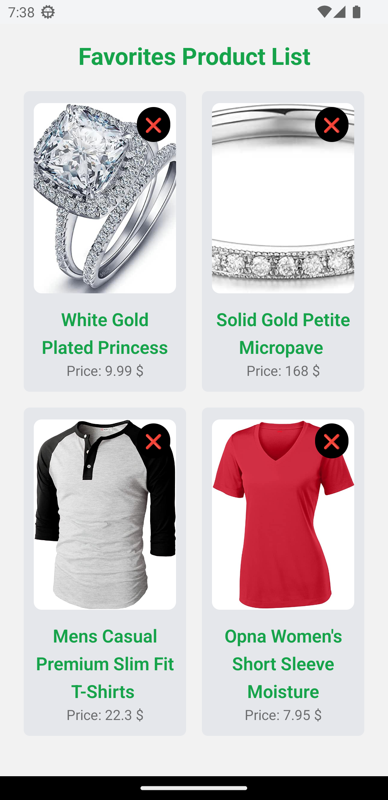

# Product Listing with Firebase Auth

> Developer Guide

## How to run

    ```bash
    git clone repo-url
    yarn
    yarn start
    ```

> features with screenshot

-   # Firebase Authentication

    login / register with email
    
    continue with google
    
    logout
    

-   # Home Page
    Product Grid List (from fakeStore api)
    
-   # Product Detail Page

    -   show single product page
    -   show title, image, description, category, price
    -   option for add product to favorite list
        

-   Favorites Product List
    -   show list of Favorites products
    -   remove form Favorites products


