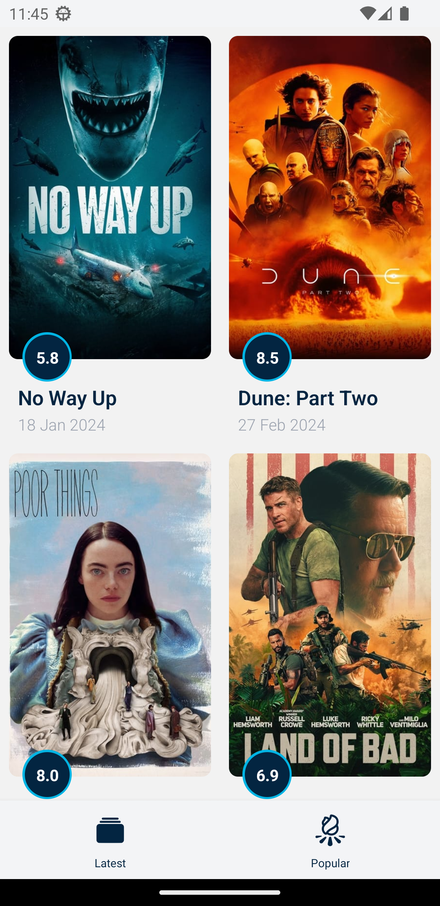

# TMDB Movie List App with React Native

> Developer Guide

## How to run

    ```bash
    git clone repo-url
    yarn
    yarn start
    ```

> features with screenshot

-   # Latest Movie List

    

-   # Popular Movie List

    

-   # Movie Detail Page

    

-   # Unite Test

    
